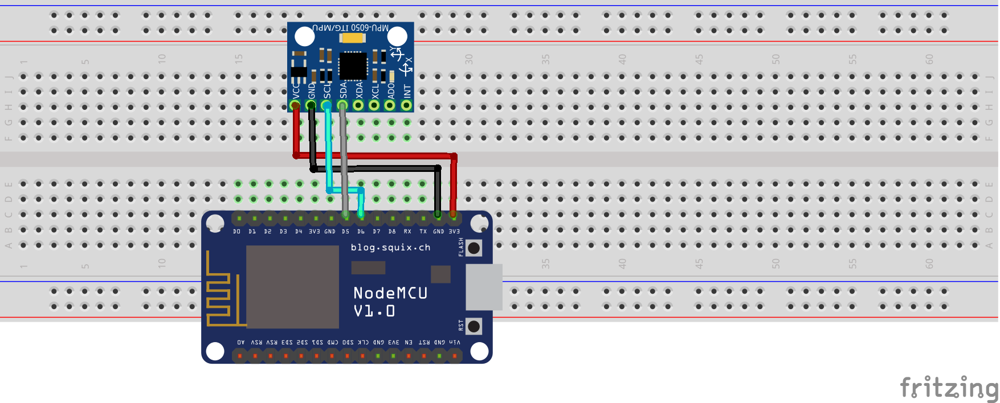

# nodemcu-gy521

## Créditos

Este tutorial é baseado na publicação do [Filipe Flop](https://www.filipeflop.com/blog/acelerometro-com-esp8266-nodemcu/)

### Visão geral

Com esse tutorial será possível capturar os dados gerados pelos sensores do acelerômetro `GY521`.

O sensor utilizado nesse exemplo é o GY521. Em conexões do tipo [I2C](https://github.com/sganzerla/embarcados-protocolos-comunicacao/tree/master/I2C) o `GY521` são endereçados como `0x68` e `0x69` com pino `CS` setado como `LOW` e `HIGH` respectivamente.

Outros modelos de acelerômetro como o `ADXL345` o endereço é `0x53` caso o pino `CS` seja `LOW` e caso ele seja `HIGH` o valor muda para `0x1D`.

### Montagem do Circuito



### Hardware necessário

```
- a) 1 Placa NodeMCU com cabo USB
- b) 1 Acelerômetro GY521
- c) 1 Protoboard
- d) 6 Cabos de conexão
```

#### a) Placa Arduino Uno


#### b) Acelerômetro GY521


#### c) Protoboard


#### d) Cabos de conexão


## Fonte

[Filipe Flop](https://www.filipeflop.com/blog/acelerometro-com-esp8266-nodemcu/) - Acessado em Maio 2020.
