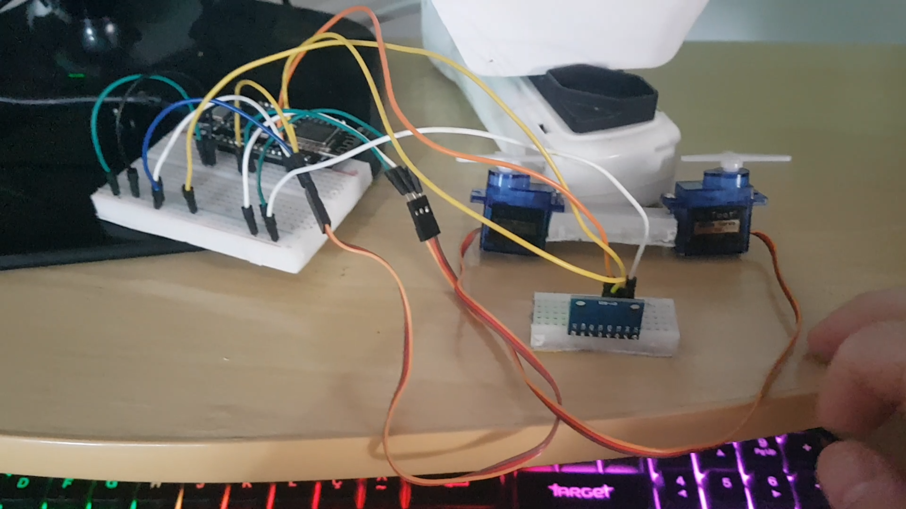
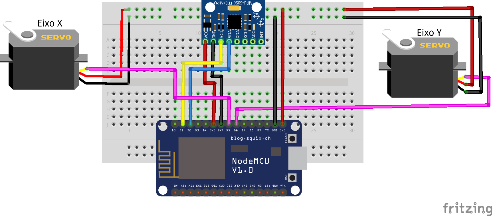

# 2-move-servo

## Créditos

Esse tutorial é uma adpatação do projeto de
[Giuseppe Caccavale](http://www.giuseppecaccavale.it/arduino/mpu-6050-gy-521-arduino-tutorial/).

## Objetivo

O programa tem o objetivo de fazer a leitura dos dados gerados pelo `GY521` conectado como `SLAVE` no protocolo `I2C` ao `NodeMCU` convertendo os dados dos eixos X e Y do acelerômetro para ângulos e movendo dois servos motores representando cada um dos eixos.

As conexões do `GY-521` com o `NodeMCU` devem ser as seguintes:

GY-521 | NODEMCU
------ | -------
 VCC   |  3v
 GND   |  G
 SDA   |  D2
 SCL   |  D1

### Vídeo

[](https://youtu.be/68MxqiCudaU)

### Circuito



### Função Conversão Ângulos

Função envia como primeiro parâmetro o eixo desejado para obter o valor (X ou Y).
Em seguida faz um map entre os valores dos ângulos e os limites de movimentação dos servo motores, que no modelo `SG90 Micro Tower` é de apenas 180°.

```
    Roll = FunctionsPitchRoll(AcX, AcY, AcZ);  
    Pitch = FunctionsPitchRoll(AcY, AcX, AcZ); 

    int ServoRoll = map(Roll, -90, 90, 0, 179);
    int ServoPitch = map(Pitch, -90, 90, 179, 0);

```

Essa é a função que converte os valores brutos para ângulos.

```
double FunctionsPitchRoll(double A, double B, double C)
{
    double DatoA, DatoB, Value;
    DatoA = A;
    DatoB = (B * B) + (C * C);
    DatoB = sqrt(DatoB);

    Value = atan2(DatoA, DatoB);
    Value = Value * 180 / 3.14;

    return (int)Value;
}
```

### Hardware necessário

```
- a) 1 Placa NodeMCU com cabo USB
- b) 1 Acelerômetro GY521
- c) 2 Servo Motor Tower SG90
- d) 1 Protoboard
- e) 12 Cabos de conexão
```

#### a) Placa NodeMCU 8266


#### b) Acelerômetro GY521


#### c) Servo Motor Tower SG90


#### d) Protoboard


#### e) Cabos de conexão


