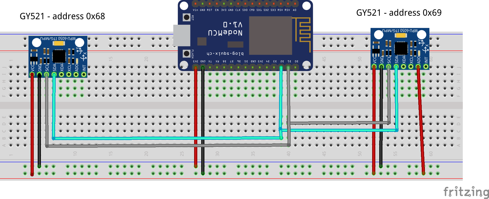

# scan-address

## Objetivo

O objetivo desse programa é identificar em qual dos dois possíveis endereços hexadecimal está setado o sensor.  

## Conceitos

Um microcontrolador pode ter até dois sensores GY-521 interligado no seu circuito através de conexão `MASTER-SLAVE` `I²C`.

As portas padrão do `NodeMCU8266` para o protocolo são:

D1 -> SDA (Data)
S2 -> SCL (Clock)

Os endereços `I²C` do dispositivo são alteráveis utilizando o pino `ADO`, quando ele está ligado a energia o dispositivo assume o endereço hexadecimal `0x69` e quando não está ligado o valor é `0x68`.

## Circuito

Esse circuito mostra como é possível utilizar dois sensores `GY521` juntos com o mesmo microcontrolador.

## [Vídeo](multiple-i2c.webm)

Vídeo demonstrando em qual endereço está o sensor. Nesse vídeo estão dois sensores ligados.
