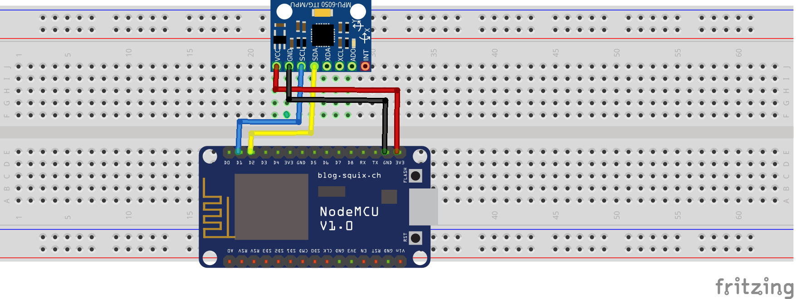

# get-angle

## Objetivo

O objetivo desse programa é obter os dados do acelerômetro e do giroscópio apresentandos no Serial Console puros e também convertidos em ângulos.  
Além disso a opção de se alterar a escala de leitura tanto do acelerômetro quanto do giroscópio.

## Conceitos

O giroscópio possui quatro faixas possíveis de escala: 250, 500, 1000 e 2000 graus por segundo e o acelerômetro também possui quatro faixas de escala: 2, 4, 8 e 16 g.

Há a opção de calibragem dos sensores para ajustar valores.

## Circuito



## Resultado

```
 GyX = -123.23 °/s| GyY = -140.51 °/s| GyZ = -125.19 °/s| Tmp = 25.61 °C| AcX = -3.00 g| AcY = -1.90 g| AcZ = 1.59 g
 Offsets: GyX = -16144 | GyY = -18405 | GyZ = -16422 | AcX = -16401 | AcY = -7774 | AcZ = 6543
          GyX = 15710 | GyY = 18483 | GyZ = 15771 | Tmp = -3728 | AcX = 20606 | AcY = 7741 | AcZ = -6964
Gyro Full-Scale = ±250 °/s
Accl Full-Scale = ±8 g
          GyX = 119.92 °/s| GyY = 141.09 °/s| GyZ = 120.39 °/s| Tmp = 25.57 ��C| AcX = 5.03 g| AcY = 1.89 g| AcZ = -1.70 g
Offsets:  GyX = 15697 | GyY = 18486 | GyZ = 15777 | AcX = 16519 | AcY = 7742 | AcZ = -6946
          GyX = -16131 | GyY = -18412 | GyZ = -16419 | Tmp = -3728 | AcX = -12283 | AcY = -7767 | AcZ = 6529
Gyro Full-Scale = ±250 °/s
Accl Full-Scale = ±8 g
          GyX = -123.14 °/s| GyY = -140.55 °/s| GyZ = -125.34 °/s| Tmp = 25.57 °C| AcX = -3.00 g| AcY = -1.90 g| AcZ = 1.59 g
 Offsets: GyX = -16135 | GyY = -18394 | GyZ = -16424 | AcX = -16406 | AcY = -7784 | AcZ = 6536
          GyX = 15702 | GyY = 18467 | GyZ = 15774 | Tmp = -3696 | AcX = 20635 | AcY = 7750 | AcZ = -6949
```
