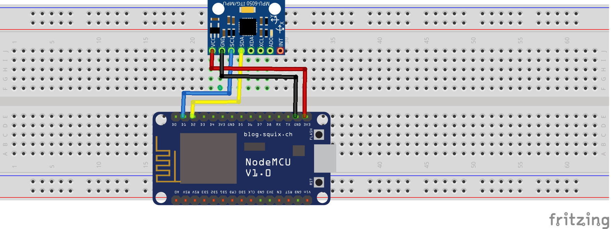

# auto-test

## Objetivo

O objetivo desse programa é garantir que o sensor esteja de acordo com os padrões do fabricante para isso são realizados testes.

## Conceitos

Segundo o datasheet do fabricante a tolerância aceitavel para variação nos testes é de no mínimo -14% e no máximo 14%.

## Circuito



## Resultado

```
perc_Xg = -0.95% | perc_Yg = -0.73% | perc_Zg = -0.68% | perc_Xa = -4.27% | perc_Ya = -0.42% | perc_Za = -0.77%
Register 13 = 1010000 | Register 14 = 1001111 | Register 15 = 10110111 | Register 16  = 1111100
XG_TEST = 10000 | YG_TEST = 1111 | ZG_TEST = 10111 | XA_TEST = 1011 | YA_TEST = 1011 | ZA_TEST = 10100
 FT_XG = 6429.64 | FT_YG = -6146.88 | FT_ZG = 8808.63 | FT_XA = 1940.63 | FT_YA = 1940.63 | FT_ZA = 2615.98
 Gyro Config = 0
 Accl Config = 1000
 Gyro Config = 1110000
 Accl Config = 1111000
 Gyro Config = 1110000
 Accl Config = 1111000
 Gyro Config = 0
 Accl Config = 1000
 GyX (off) = -432 | GyY (off) = 70 | GyZ (off) = -642 | Tmp (off) = -4480 | AcX (off) = 8406 | AcY (off) = -206 | AcZ (off) = 1102
 GyX (on) = -116 | GyY (on) = -1567 | GyZ (on) = 2181 | Tmp (on) = -4432 | AcX (on) = 2116 | AcY (on) = 937 | AcZ (on) = 1668
 STR_Xg = 316.00 | STR_Yg = -1637.00 | STR_Zg = 2823.00 | STR_Xa = -6290.00 | STR_Ya = 1143.00 | STR_Za = 566.00
 ALL AXIS PASSED SELF TEST!
```
