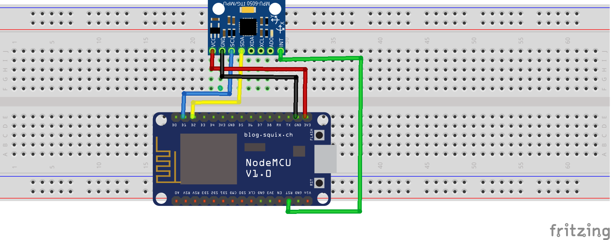

# detect-motion

## Objetivo

O objetivo desse programa é detectar movimento do sensor.

## Lógica do programa

- verifica se o acelerômetro está funcionando
- define o acelerômetro HPF para resetar a placa
- define o acelerômetro LPF para banda 256Hz
- ativa a interrupção de movimento
- define a duração da detecção de movimento
- define o limite de detecção de movimento
- atraso de 1ms
- define o acelerômetro HPF para HOLD
- define a frequência de ativação
- ativa o mode de ciclo

## Circuito



## Resultado

```
Motion detect Status : 10001000
1
Going to sleep. . .
I'm Awake!
Motion detect Status : 1000100
1
Going to sleep. . .
I'm Awake!
Motion detect Status : 10000000
1
Going to sleep. . .
I'm Awake!
Motion detect Status : 1000000
1
Going to sleep. . .
```

## Requisitos

Instalar a biblioteca MPU5060.h, disponível no [link](https://github.com/jrowberg/i2cdevlib/zipball/master), descompactar o arquivo e colar as pastas que estão dentro de Arduino no diretório de lib da sua IDE.
