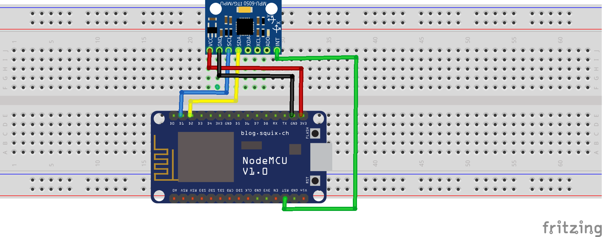

# send-mqtt

## Objetivo

O objetivo desse programa é detectar movimento do sensor resetando a placa, a cada reinicio esta sendo informado a voltagem da carga elétrica e enviar os dados para um broker pelo protocolo MQTT.

## Circuito



## Resultado

```
.I'm Awake!
Motion detect Status : 0
Supply Voltage : 3.5457 V
Going to sleep. . .
r$�#��'o�lo'���cp��l;ds$p�o��l��#n�|$�$�b��'g�`�'gd`os���'�d`sۛg�l`�r�x�l�r� ��'�
.I'm Awake!
Motion detect Status : 0
Supply Voltage : 3.5434 V
Going to sleep. . .
{l�c��o'�$'o���#x��d{l;l8�'��d��bo�|$�l�c��'g�`�gol`';Ǜ�o�l ;��n�$`�{�p�d�s�`��n�
.I'm Awake!
Motion detect Status : 0
Supply Voltage : 3.5445 V
Going to sleep. . .
```

## Requisitos

Instalar a biblioteca MPU5060.h, disponível no [link](https://github.com/jrowberg/i2cdevlib/zipball/master), descompactar o arquivo e colar as pastas que estão dentro de Arduino no diretório de lib da sua IDE.
